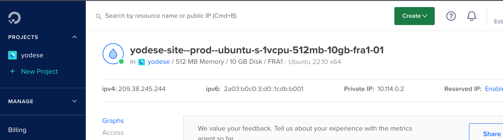

# IPs & Domains

## Setup

- Bought via NameCheap
- Managed via Netlify

> Why Netlify?
>
> That way I can deploy static site through Netlify and get domain + SSL cert.

### Configuring records for domain and SSL cert (HTTPS)

TODO

DigitalOcean droplet IPs

### Configuring records for mailserver

TODO

## Reserved IP

- Current I use the IPs of serveer containers directly in configuration.
  If the project grows, a more sustainable alternative would be to use
  static / reserved IPs - IP that doesn't change, but the IP it forwards to
  MAY change.

  See more: <https://docs.digitalocean.com/products/networking/reserved-ips/>
