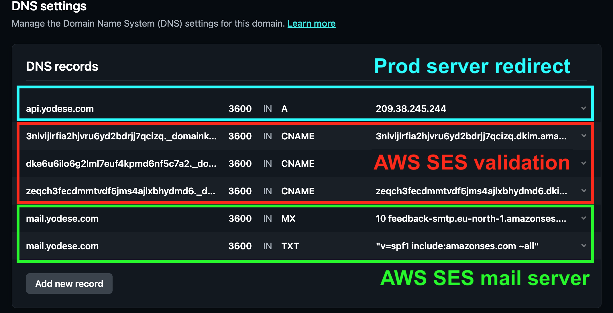

# IPs & Domains

## Setup

- Bought via NameCheap
- Managed via Netlify

> Why Netlify?
>
> That way I can deploy static site through Netlify and get domain + SSL cert.

### Configuring records for domain and SSL cert (HTTPS)

#### Website (static files)

Domain + SSL for static website is handled by [Netlify](https://app.netlify.com/) for us.

#### Server / container

To have HTTPS and domain coverage for a server running within a cloud container:

1. Forward (sub)domain to the server's location:

    - a) Set up an `A record` if the server is identified by an *IP*.
    - b) Set up a `CNAME record` if the server is identified by *ANOTHER DOMAIN*

    Where to find the server's IP / domain?

    - DigitalOcean droplet IPs

      

    Final domain settings may look like this:

    - Netlify

      

2. Set up SSL certificates using Let's certificate & certbot.

   For more details see the [init-letsencrypt.sh](../../server/scripts/init-letsencrypt.sh) script

### Configuring records for mailserver

TODO

## Reserved IP

- Current I use the IPs of serveer containers directly in configuration.
  If the project grows, a more sustainable alternative would be to use
  static / reserved IPs - IP that doesn't change, but the IP it forwards to
  MAY change.

  See more: <https://docs.digitalocean.com/products/networking/reserved-ips/>
