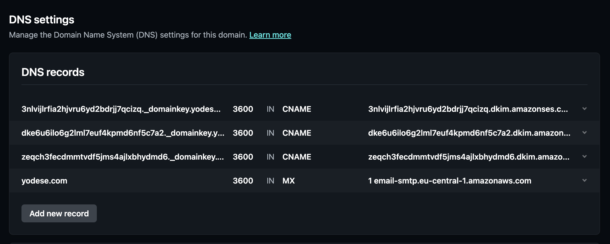
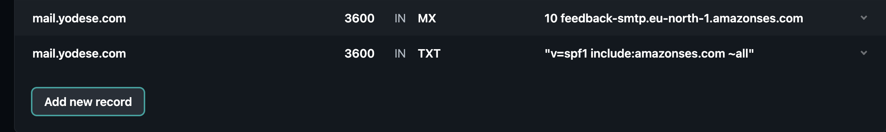

# Mailserver

## Updates

### UPDATE 2023-05-16: Issues with Amazon SES, Docker Mailserver and SendGrid.

I had two needs:
- Send out emails when form is completed
- (Optional) receive emails

Initially I wanted to go with Amazon SES.
However, I needed to pass verification by them, and I was rejected.
Also, there's no EASY way to forward emails (e.g. [see this tutorial](https://aws.amazon.com/blogs/messaging-and-targeting/forwarding-emails-automatically-based-on-content-with-amazon-simple-email-service/)).

Then I used Docker Mailserver. But I found out that even with working
Mailserver, I could not send emails, because most of major email clients
accept emails only from recognized domains (e.g. gmail will accept email
from SendGrid, but not from example.com). To put it differently, they don't
accept email via port :25. And to use different port, email has to be relayed
through different service (like SendGrid). So something like Docker Mailserver
is really useful only for use in a private network / not via Gmail mail servers.

I tried to use SendGrid as the relay server (Docker Mailserver even offers
that option). However, then there was the problem of how to forward incoming
emails. Docker Mailserver provides option to rewrite the header / envelope,
and to set email "alias"es, that actually point to external email addresses.
This in combination could be used to:
1. On received email redirect it to external email based on which (our) email
address it was sent.
2. The info on original sender would be still persisted.
3. SendGrid was used as relay so that we could send this email to my gmail account.

Unfortunately, SendGrid requires you to declare which email addresses will be using
the relay. And it cannot be set on a domain level, but on email level. And
Docker Mailserver was rewriting the emails as coming from e.g.
`com.gmail=dwaper@example.com` (when it came from `dwaper@gmail.com`).
And because this wasn't among the SendGrid's recognized email addresses,
SendGrid refused the email too.

To conclude all this, I made an issue here
- https://github.com/docker-mailserver/docker-mailserver/issues/3350

### UPDATE 2023-05-17: Handling mail via NodeJS.

Following the issues above, I came across [smtp2http](https://github.com/alash3al/smtp2http/), which promised to convert incoming SMTP connections (emails) into webhooks.

NOTE: Other similar solutions:
- https://github.com/mailhog/MailHog
- https://www.reddit.com/r/selfhosted/comments/xstbzd/receiving_only_mail_server_for_forwarding_as/

In theory, this should have worked, because
1. Docker Mailerserver supported email forwarding,
2. Since the email would be forwarded only within the docker container network, the issues with trusted mail server relays shouldn't apply.

I tried:
- Redirecting to test@localhost:25 - didn't work because email domain/IP must not include port
- Redirecting to test@localhost and test@\[127.0.0.1\] ([see thread](https://serverfault.com/questions/905886/is-it-possible-to-send-and-receive-an-email-from-an-ip-address-instead-from-a-do)) - didn't work because it's containerised, so "localhost" was actually Docker Mailserver's localhost.
- Redirecting to test@smtp2http - This did work, but smtp2http was misconfigured and was responding with error.

To fix smtp2http, I'd have to build the image (written in Go) myself, because the image was last updated in 2020 and not in sync
with git repo.

But at this point I realised that, if we can forward email within
the container network, then we can a [Node server to receive the email and send the email within JS context](https://stackoverflow.com/questions/63592362). And hence, I came full circle, from starting with Nodemailer, then moving to Docker Mailserver and other,
and then coming back to Nodemailer together with an [STMP server](https://simonjcarr.medium.com/create-an-smtp-server-with-nodejs-5688d8fd882e).

## Intro

We use [Node STMP server](https://simonjcarr.medium.com/create-an-smtp-server-with-nodejs-5688d8fd882e) + [Nodemailer](https://nodemailer.com/usage/) to receive (forward) and send emails. We use [SendGrid](https://app.sendgrid.com/) as a [mail relay server](https://www.mailjet.com/blog/email-best-practices/what-is-an-smtp-relay/).

> Why Node STMP server + Nodemailer?
>
> See the updates above.
>
> Furthermore, before concluding to the options described above, we considered several options:
>
> 1. Run own mailserver instance
>    - This added the complexity of needing to either deploy multiple compute instance (like EC2) or deploy the app using docker-compose.
>    - docker-compose was initially an obstacle, but now the project uses it, so 
>      using own mailserver instance was interesting.
>    - Unfortunately, then we hit issue that in the mailing world, we need a [mail relay server](https://www.mailjet.com/blog/email-best-practices/what-is-an-smtp-relay/), so we still needed to use a SaaS solution (e.g. SendGrid) to get the emails
>      delivered if we decided to send them.
>    - Nevertheless, this solution was good because it meant we could RECEIVE emails.
>
> 2. Use SaaS solution
>    - Ideally something that's free
>    - Here I was concerned about the possibility to RECEIVE emails, managing DNS records, etc.
>
> To be frank, I didn't explore SaaS options of like SendGrid and similar as much as I maybe should have.

Other useful apps from nodemailer:
- https://nodemailer.com/app/
- https://emailengine.app/

Other (unexplored) options:
- https://haraka.github.io/getting_started (Looks solid)
- https://www.wpdiaries.com/mail-forwarder/

## Setup

### Nodemailer + Node SMTP server

#### 1. Set up Nodemailer and SMTP server

Follow these guides:
- <https://nodemailer.com/usage/>
- <https://simonjcarr.medium.com/create-an-smtp-server-with-nodejs-5688d8fd882e>
- <https://www.twilio.com/blog/send-smtp-emails-node-js-sendgrid>

#### 2. Set up SendGrid

Head over to <https://app.sendgrid.com/settings/sender_auth> to

- Authenticate the domain
- Authenticate the email you use to send forwarded emails (Single Sender Verification) - e.g. `admin@system-mail.example.com`

Then create an API key at <https://app.sendgrid.com/settings/api_keys>. This allows us to use their mail relay.

And set the API secret as `MAIL_RELAY_PASSWORD` in Gitlab variables.

Finally, you can check how many email have already been sent on [SendGrid dashboard](https://app.sendgrid.com/).

### Docker Mailserver (DMS)

See the DMS guide <https://docker-mailserver.github.io/docker-mailserver/latest/usage/>

Also this is a very good practical tutorial that _almost_ got me there
- https://www.libe.net/en-docker-mailserver#mail-server-commissioning

Requirements

- Domain where you can manage DNS records
- Open ports for email communication on the server / docker

Learn more:
- https://docker-mailserver.github.io/docker-mailserver/latest/usage/#setting-up-tls
- https://docker-mailserver.github.io/docker-mailserver/latest/config/security/understanding-the-ports/
- https://docker-mailserver.github.io/docker-mailserver/latest/config/advanced/mail-forwarding/relay-hosts/
- https://docker-mailserver.github.io/docker-mailserver/latest/config/best-practices/dkim_dmarc_spf/
- https://docker-mailserver.github.io/docker-mailserver/latest/introduction/
- https://docker-mailserver.github.io/docker-mailserver/latest/examples/tutorials/basic-installation/#using-dms-as-a-local-mail-relay-for-containers
- https://github.com/orgs/docker-mailserver/discussions/2825
- https://github.com/orgs/docker-mailserver/discussions/2812
- https://serverfault.com/questions/1033688/recommended-ufw-settings-for-mailserver-with-postfix-dovecot
- https://github.com/docker-mailserver/docker-mailserver/issues/1278
- https://github.com/docker-mailserver/docker-mailserver/pull/3270
- https://github.com/docker-mailserver/docker-mailserver/issues/1261
- https://support.google.com/mail/answer/10336?visit_id=638198418088507878-2875705587&p=NotAuthorizedError&rd=1
- https://www.linuxquestions.org/questions/linux-networking-3/sendmail-configuration-connection-timed-out-with-alt4-gmail-smtp-in-l-google-com-4175510482/
- https://docs.sendgrid.com/glossary/smtp-relay
- https://docs.sendgrid.com/for-developers/sending-email/sender-identity
- https://sendgrid.com/blog/whats-the-difference-between-ports-465-and-587/
- https://serverfault.com/questions/297498/postfix-lost-connection-with-somehost-while-receiving-the-initial-server-gree
- https://serverfault.com/questions/488606/how-to-automatically-forward-mail-with-postfix-dovecot

### Amazon SES

#### 1. Basic pointers

Region Name: `Europe (Stockholm)` 
Region: `eu-north-1` 
Endpoint: `email-smtp.eu-north-1.amazonaws.com` 
Protocol: `SMTP`

This is a very good and end-to-end tutorial, although
I wasn't following it at first while writing this.

https://blog.tericcabrel.com/send-email-nodejs-handlebars-amazon-ses/

Learn more:
- https://moosend.com/blog/free-smtp-server
- https://docs.aws.amazon.com/ses/latest/dg/send-email-smtp.html
- https://docs.aws.amazon.com/general/latest/gr/ses.html
- https://docs.aws.amazon.com/ses/latest/dg/smtp-connect.html
- https://docs.aws.amazon.com/ses/latest/dg/send-email-smtp-client-command-line.html

#### 2. Point to Amazon SES in Netlify DNS (MX record)

- https://answers.netlify.com/t/support-guide-how-can-i-receive-emails-on-my-domain/178

#### 3. Domain verification for Amazon SES via Netlify DNS

DKIM

- https://docs.aws.amazon.com/ses/latest/dg/creating-identities.html#verify-domain-procedure
- https://eu-north-1.console.aws.amazon.com/ses/home?region=eu-north-1#/verified-identities/example.com?tabId=authentication

SFP (To enable MAIL FROM with my own domain)

- https://docs.aws.amazon.com/ses/latest/dg/mail-from.html
- https://docs.aws.amazon.com/ses/latest/dg/send-email-authentication-dmarc.html

#### 4. Amazon SES credentials

- https://eu-north-1.console.aws.amazon.com/ses/home?region=eu-north-1#/smtp

#### 5. Amazon SES move out of sandbox

- https://docs.aws.amazon.com/ses/latest/dg/request-production-access.html

## Further reading

If you want to learn more about actually running your own mailserver, see below:

- https://github.com/docker-mailserver/docker-mailserver
- https://docker-mailserver.github.io/docker-mailserver/latest/
- Tutorial
  - https://docker-mailserver.github.io/docker-mailserver/latest/usage/
