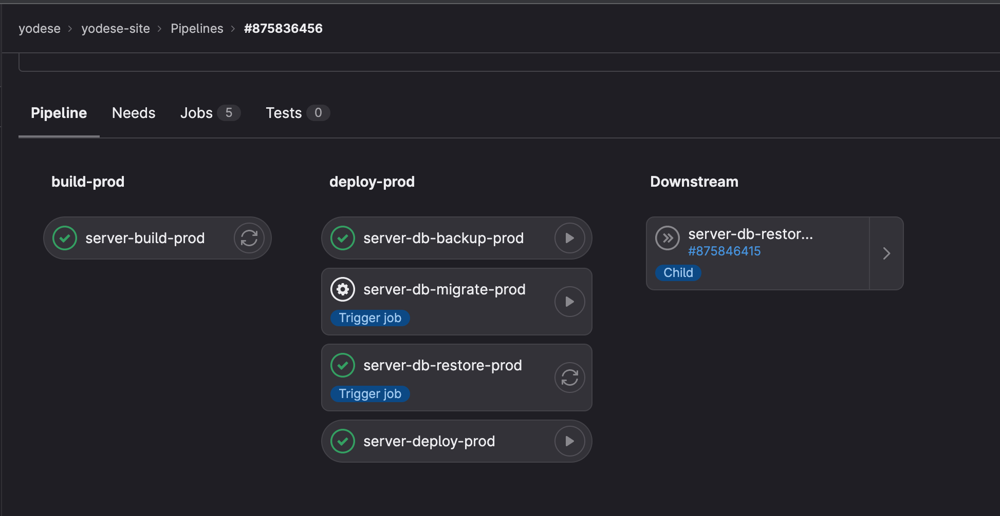
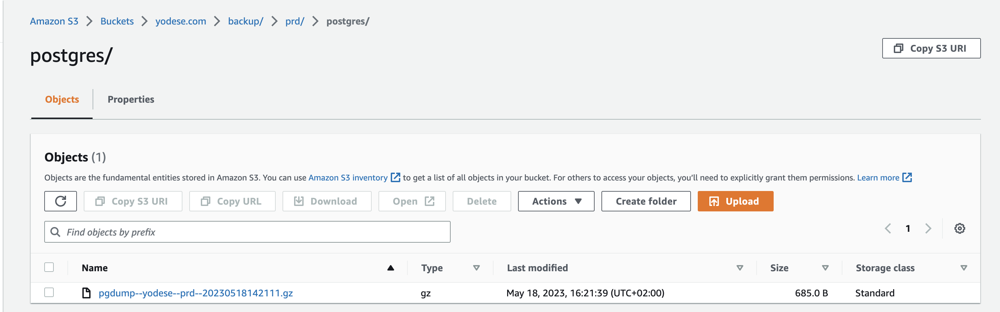
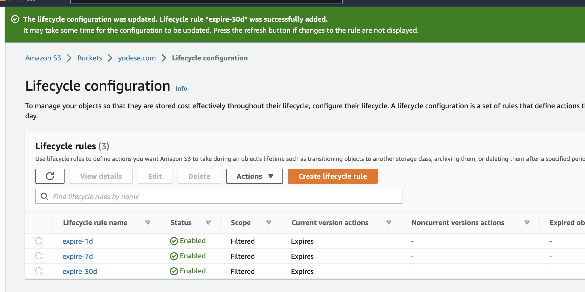

# SQL Database

## Intro

We use PostgreSQL docker image as the database.

> Why PostgreSQL?
>
> Using a standard relational DB gives a lot of flexibility for future changes.
> As example, if we needed to handle user sessions or auth, we could use
> existing solutions.
>
> Also using SQL DB gives us option to try the Nuxt stack from
> <https://sidebase.io/sidebase/welcome/stacks>
> where they use Prisma.

<br/>

> Runner up - [Supabase](https://supabase.com/pricing)?
>
> Before deciding with own instance of PostgreSQL, I was considering Supabase,
> because they offer 2x 500 MB databases for free.
>
> Supabase was an interesting choice, because:
>
> 1. AWS RDS starts at $20-30 per month.
> 2. Supabase offers 2 projects with 500 MB for free.
> 3. Running own instance of SQL DB presents 2 challenges:
>    1. We have to manually make backups and restore DB in case of a crash.
>       - HOWEVER, Supabase offers auto-backups for $25/mo tier only.
>       - AND in the end we implemented backups for own instance anyway.
>    2. We increase risk of losing/exposing data if we ran it on the same compute
>       instance as the server. Or we'd have to buy another instance just for
>       the DB.

## Setup

### PostgreSQL

1. To start PostgreSQL database locally, the following command makes the database
available at `localhost:5432`.

   ```sh
   npm run docker:start:local
   ```

Have a look at `docker-compose.yml` and `schema.prisma` to see
how to interact with PostgreSQL database.

### Database backup

To run regular backups of the DB, we run this setup:

1. Docker container with [cron](https://en.wikipedia.org/wiki/Cron) capabilities
   ([supercronic](https://github.com/aptible/supercronic))
2. Every night, cron triggers a script that runs [pg_dump](https://www.postgresql.org/docs/current/app-pgdump.html)
   against the DB. This creates a db backup file in the runner container.
3. The exported db backup file is subsequently uploaded to cloud storage (see below).

Learn more:

- <https://www.vinchin.com/en/blog/how-to-backup-and-restore-postgresql-database-tools-and-steps.html>
- <https://arctype.com/blog/backup-postgres-database/>

#### Update 2023-05-23 - Automatic backups and updates from CI/CD pipelines

I've added pipeline scripts to manage backups + restores + migrations automatically.

To test it out:

1. Create a production database (or make sure it's running).

2. Create some arbitrary data in the database.

3. Trigger the deployment CI/CD pipeline by pushing changes to `main`.

4. Trigger `server-db-backup-prod` job in the pipeline from step 3. This should
   create a backup in AWS S3. Note down the file name.

5. Head over to Gitlab CI/CD > Variables, and set the `SERVER_DB_RESTORE_FILE_PROD`
   variable to the file name generated in step 4.

6. Create some arbitrary data in the database. But different than in step 2.

7. Trigger `server-db-restore-prod` job in the pipeline from step 3. This should
   restore the DB back to the backup made in step 4. The changes from step 6
   should be gone.

Congrats, now you know how to backup and restore the database!



### Database backup storage (AWS S3)

Use AWS S3 to store database backups.

Relevant tutorials

- <https://www.vinchin.com/en/blog/how-to-backup-and-restore-postgresql-database-tools-and-steps.html>
- <https://arctype.com/blog/backup-postgres-database/>
- <https://adamtheautomator.com/upload-file-to-s3/>

#### 1. Create new S3 bucket

1. Name it accoding to the domain, e.g. `domain.com`.

#### 2. Create user in IAM that has read/write access ONLY to the given bucket or subdirectory

1. Name it e.g. `domain-db-backup--prod`

   See

   - <https://repost.aws/knowledge-center/s3-console-access-certain-bucket>

2. Create user group tha the user belongs to

   Name it e.g. `domain-db-backup--prod`

3. Create custom policy to scope access ONLY to our S3 bucket. Specifically,
   give access ONLY to the directory with DB backups for specific environment (prd).

   This means that, if you want to add a new environment, or make backups for
   other services, you should create new users + user groups for those scenarios
   only.

   Name it e.g. `domain-db-backup--prod`

   ```json
   {
     "Version": "2012-10-17",
     "Statement": [
       {
         "Sid": "AllowAccessOnlyInDomainPrdDbBackup",
         "Effect": "Allow",
         "Action": [
           "s3:GetObject",
           "s3:GetObjectVersion",
           "s3:PutObject",
           "s3:PutObjectTagging"
         ],
         "Resource": ["arn:aws:s3:::domain.com/backup/prd/postgres/*"]
       },
       {
         "Sid": "AllowListBucketOnlyInDomainPrdDbBackup",
         "Effect": "Allow",
         "Action": ["s3:ListBucket", "s3:ListBucketVersions"],
         "Resource": ["arn:aws:s3:::domain.com"],
         "Condition": {
           "StringLike": {
             "s3:prefix": ["backup/prd/postgres/*"]
           }
         }
       }
     ]
   }
   ```

4. Get user's access keys.

   See

   - <https://docs.aws.amazon.com/sdk-for-javascript/v2/developer-guide/getting-your-credentials.html>
   - <https://docs.aws.amazon.com/cli/latest/userguide/cli-authentication-user.html>

5. Store the data in your password manager as `AWS_S3_BACKUP_DB_KEY_PROD` and `AWS_S3_BACKUP_DB_PWD_PROD`.

   These env vars will be passed from Gitlab's CI to docker-compose to container that does
   DB backups.

   See

   - <https://docs.aws.amazon.com/cli/latest/userguide/cli-configure-envvars.html>

#### 3. Check that crontab backs up the DB

```sh
docker-compose up -d
docker exec -it server-cron-1 bash
# In container
aws sts get-caller-identity # Verify we can connect to AWS with credentials
# Run postgres-backup.sh script.
...
```

Then check the S3 bucket.



### Database backup storage expiry (AWS S3)

The backups should be set up to expire after some time to be smart with resources.

#### 1. Set up expiration tags & their expiration lifecycles on AWS S3

Follow this guide <https://stackoverflow.com/a/75059780/9788634>



#### 2. Tag uploaded backups with expiration tags

The `postgres-backup.sh` script accepts a positional arg to specify expiration tag.

By assigning these tags, we specify when the given object should expire.

See <https://docs.aws.amazon.com/cli/latest/reference/s3api/put-object-tagging.html>.

## Migrations

Database migrations are step-wise changes to database schema. You can think
of it similarly as git:

1. To arrive at the final state, we apply changes in chronological order.
2. While the changes may add or remove features, the RECORDS of these changes
   (migrations) are append-only - full history of changes is available.
3. The changes are stored in source control (git).

Generally, when we create a database instance anew, we want to:

1. Run all past migrations to arrive at the present state of the database schema.
2. Populate the database with previous database backups.

### Prisma

#### Cheatsheet

> `schema.prisma` <-- Database
>
> To update `schema.prisma` based on database, run:
>
> ```sh
> npm run prisma:<env> db pull
> ```
>
> ---
>
> `schema.prisma` --> Database
>
> To update database based on `schema.prisma`, run:
>
> ```sh
> npm run prisma:<env> db push
> ```
>
> **WARNING:** Do not use `db push` on any other than local database.
> Problem with `db push` is that it does not generate migration
> steps, it just overwrites database's current schema with what's
> in `schema.prisma`.
>
> ---
>
> PRINT STATUS
>
> Use `migrate status` to print whether any migrations or other changes are needed.
>
> ```sh
> npm run prisma:<env> migrate status
> ```
>
> ---
>
> Database --> ~~Database~~ --> Database (`schema.prisma`)
>
> You can use `migrate reset` to throw away all data and migrations, and start anew.
>
> ```sh
> npm run prisma:<env> migrate reset
> ```
>
> **WARNING:** Do not use `migrate reset` on any other than local database, it is a
> **destructive** operation.
>
> ---
>
> Database (old) vs `schema.prisma` (new) --> Migration
>
> Use `migrate dev` to "save" the changes required to happen on database to get to current
> state of `schema.prisma`.
>
> ```sh
> npm run prisma:<env> migrate dev
> ```
>
> **NOTE:** If database has older not-yet-applied migrations, they are applied to the
> database before new migration is created.
>
> ---
>
> Database (old) + migrations (new) --> Database (new)
>
> Use `migrate deploy` to apply migrations to database, but without creating anything
> new (unlike `migrate dev`). It's kinda like `npm ci` vs `npm install`
>
> ```sh
> npm run prisma:<env> migrate deploy
> ```
>
> **NOTE:** This is what we use for prod / stg databases.

#### 1. Set up PostgreSQL database with Prisma

Set up a local database against which you can create migrations:

1. Start PostgreSQL database locally. Following command makes the database available at `localhost:5432`.

   ```sh
   npm run docker:start:local
   ```

2. Verify you can connect to the database with DB management tool like [TablePlus](https://tableplus.com/download).

#### 2. Make changes to prisma.schema during development

1. After some changes are in, let's ask Prisma to generate us a migration script.
   This should result in a new entry in the `./prisma/migrations` folder.

   ```sh
   npm run prisma:<env> migrate dev
   ```

2. Commit the created migration file(s) to source control (git).

#### 3. Generate migration step (optionally without committing it)

After we have made changes to `schema.prisma`, we can apply these to our local database
with the following call:

```sh
npm run prisma migrate dev
# Optionally
npm run prisma migrate dev -- --create-only
```

#### 4. Commit the changes to git, and deploy to prod / staging

#### 5. Migrate deployed prod / staging instance

`prisma migrate dev` updated only our local instance of the database. If everything went
well, then the next step is to apply the same changes also to our production instance.

To do that, we'd need to SSH into deployed server instance, connect to the Node server
container (because it houses the `schema.prisma` file), and run the following:

```sh
# Update the prod DB according to migrations found in ./prisma directory
npm run prisma migrate deploy
```

However, to make things simpler, the same can be achieved running a `server-db-migrate-prod`
job in the Gitlab CI/CD pipeline. This job is available when changes are pushed to `main`.


