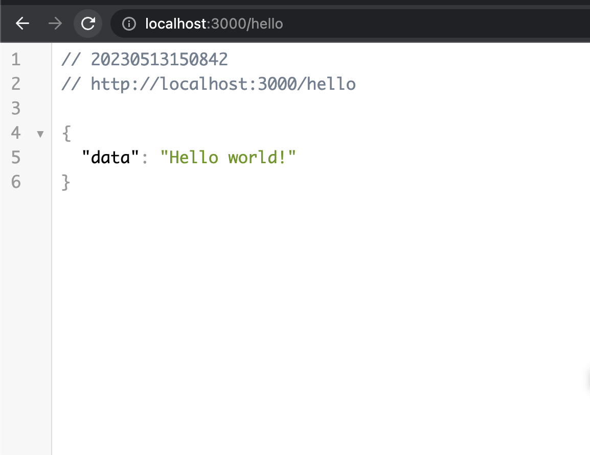
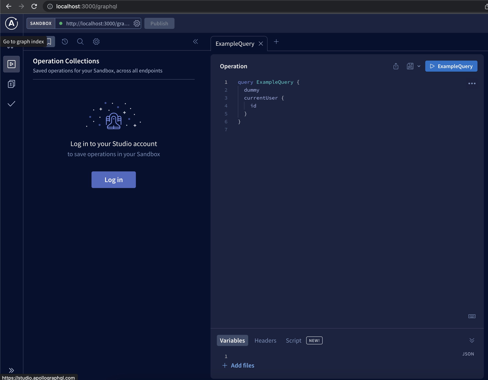

# Server

This template should help get you started developing with:

- Express
- TypeScript
- Apollo GraphQL
- Prisma (with PostgreSQL)
- Redis (for session storage)
- Multi-factor authentication flow
- Emails with nodemailer

## Getting started

### 1. Navigate to server folder.

### 2. Confirm that JS/TS env is configured

2.1 Build node server code.

```sh
npm install
npm run build
```

2.2 Run playground script to validate that TS/JS env has been set up correctly.

```sh
npm run playground
```

### 3. Confirm that server runs on local Docker configuration

3.1 Prepare docker containers.

```sh
npm run docker:install
npm run docker:build
npm run docker:start:local
```

3.2 While docker is still running, open another terminal window and
run node server locally against services running locally.

```sh
# In new terminal window
npm run dev
```

You should see a message like this in terminal:

```json
{
  "level": 30,
  "time": 1683975812255,
  "pid": 6333,
  "hostname": "Juros-MacBook-Pro.local",
  "name": "server",
  "msg": "Server running at http://localhost:3000"
}
```

3.3 Further validate that the server is working by navigating to these URLs. Both should work:

- http://localhost:3000/hello
- http://localhost:3000/graphql




### 4. Verify Prisma schema

4.1 Generate and validate prisma schema

```sh
npm run prisma:generate
npm run prisma -- validate
```

### 5. Run tests

```sh
npm run test
```

### 6. Stop services

Lastly stop the docker:

```sh
npm run docker:stop
```

## Project structure

```txt
-- src
    -- apis - How we communicate with downstream components - APIs we provide
    -- datasources - Servers upstream of us (further from the users), e.g. databases
    -- globals - opinionated, globally available code like config and loggers
    -- libs - project-agnostic libraries that could be packages on its own
    -- modules - everything that sits between datasources (upstream) and apis (downstream)
    -- utils - opinionated small utility functions that are globally available (NOTE: Use this VERY, VERY seldom!)
```

## Troubleshooting

#### docker.sock: connect: permission denied

```
permission denied while trying to connect to the Docker daemon socket at unix:///var/run/docker.sock: Get "http://%2Fvar%2Frun%2Fdocker.sock/v1.24/images/postgres:14.1-alpine/json": dial unix /var/run/docker.sock: connect: permission denied
```

If you get this on your computer, try restarting the Docker client (e.g. on Mac that's Docker Desktop), or restart the computer.
